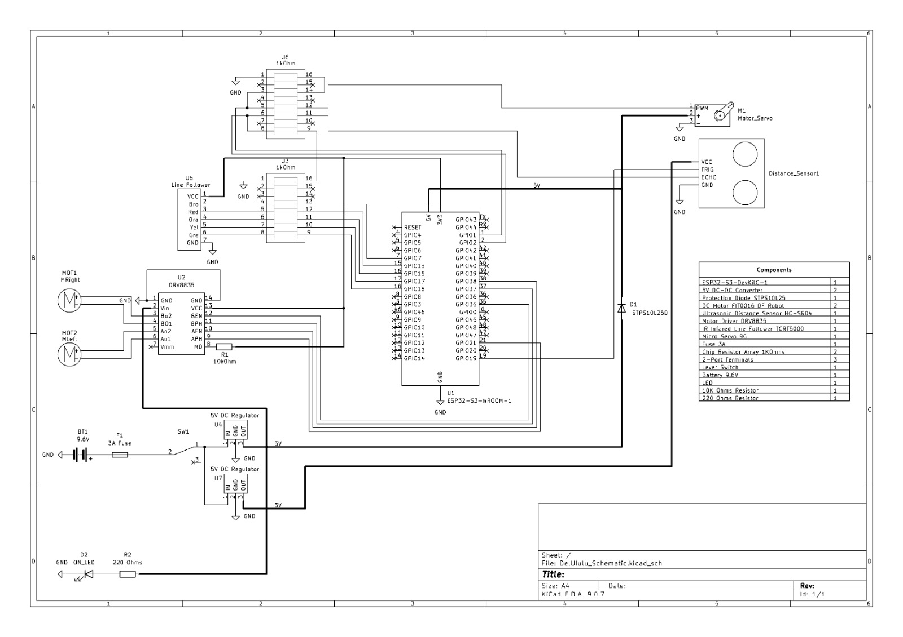
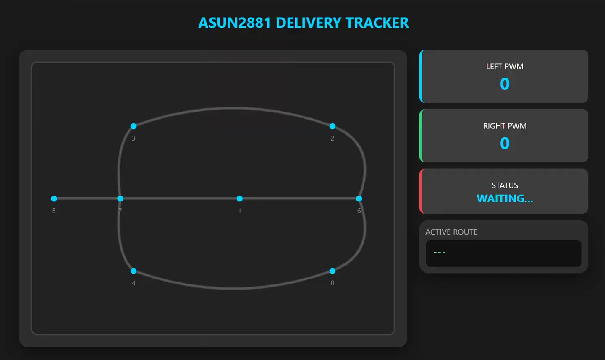
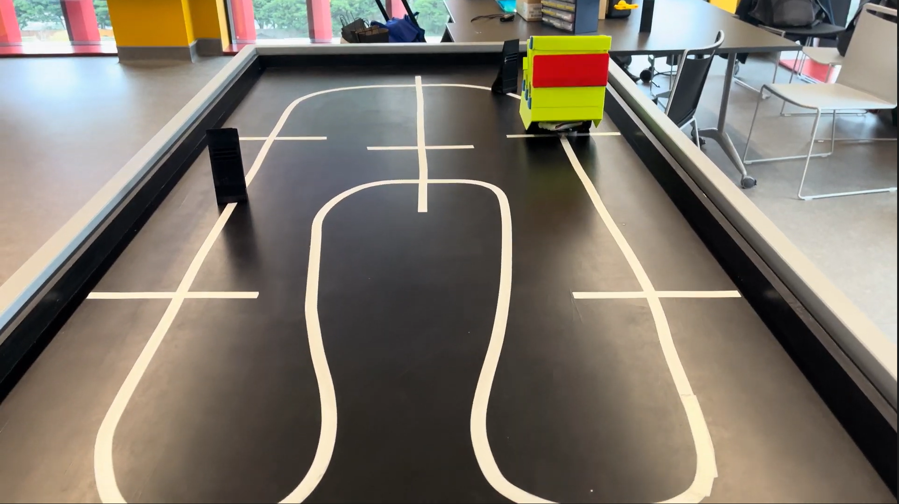

# Mobile_robotics

ESP32-based autonomous robot with real-time obstacle avoidance and pathfinding
contain the ability for line detection. Now also contains code for line following, obstacle detection, routing and rerouting, messaging an API and server to update position.
Based on the DCU module, __Mobile Robotics__ (EEN1025)

## Demo & Preview

### Images
#### Schematic

#### Website

#### Track

